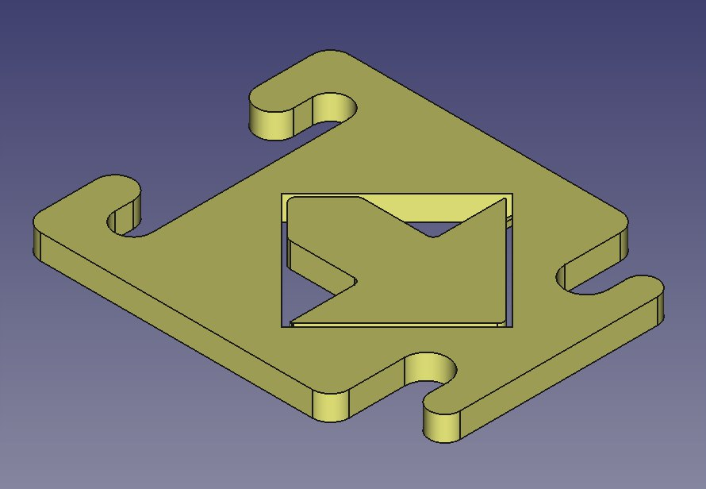

# Pezas para o reto Escornathon (Aula Nova)

- [Información sobre o reto](https://blogs.xunta.gal/aulanova/2020/11/13/ideas-propostas-e-premios-participa-no-escornathon)

## Peza para orde de movemento 'escornatintón'

A idea do deseño foi baseada en ter unha sóa peza imprimible e que se poida
cambiar a orde de movemento fixando a frecha dentro da ficha nunha das catro
posibilidades (adiante, atrás, esquerda ou dereita). Deste xeito, cun só
deseño se inclúen as 4 posibilidades de movementos do Escornabot e non hai o
problema de que falten fichas para un dos movementos porque se aproveitan
todas. Recoméndase a impresión de fornadas en distintas cores para combinar 
frechas e fichas de distinta cor.

Ficheiros (licencia [CC0 1.0](https://creativecommons.org/publicdomain/zero/1.0/)):

- [STL para imprimir](escornatinton.stl)
- [Fontes FreeCAD](escornatinton.FCStd)

